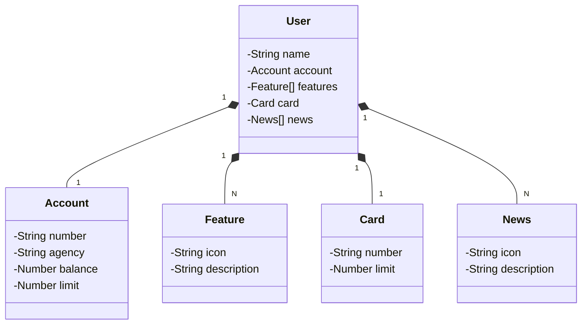

## Bradesco Java Cloud
Bem-vindo à RESTful API desenvolvida para o Bradesco Java Cloud, construída com Java 17 e Spring Boot 3 para oferecer alto desempenho, escalabilidade e facilidade de manutenção.

Principais Tecnologias
Java 17 – A mais recente versão LTS do Java, trazendo melhorias significativas de performance e recursos avançados.
Spring Boot 3 – Framework que agiliza o desenvolvimento ao oferecer configuração automática e integração simplificada.
Spring Data JPA – Abstração poderosa para manipulação de bancos de dados SQL, reduzindo a complexidade do código.
OpenAPI (Swagger) – Documentação de API clara e intuitiva, facilitando a integração e o uso da aplicação.
Railway – Plataforma de deploy na nuvem que simplifica a hospedagem e o monitoramento, além de oferecer suporte a bancos de dados e CI/CD pipelines.
Figma – Modelagem da API
A concepção desta API foi auxiliada pelo Figma, ferramenta que permitiu uma melhor abstração do domínio, facilitando a análise e o projeto da solução.

📌 Diagrama de Classes – Estrutura da API
(Insira aqui um link ou imagem do diagrama, caso disponível.)

🔍 Documentação da API (Swagger)
A API está documentada e disponível para consulta via Swagger:
🔗 Acesse a documentação aqui

⚠️ Observação: Esta API estará disponível no Railway por tempo limitado. No entanto, o código-fonte é open-source, então fique à vontade para clonar, modificar e adaptar para seus próprios projetos. Se compartilhar sua versão, não esqueça de nos marcar! 🚀😃

## [Link do Figma](https://www.figma.com/file/0ZsjwjsYlYd3timxqMWlbj/SANTANDER---Projeto-Web%2FMobile?type=design&node-id=1421%3A432&mode=design&t=6dPQuerScEQH0zAn-1)

O Figma foi utilizado para a abstração do domínio desta API, sendo útil na análise e projeto da solução.

## Diagrama de Classes (Domínio da API)

## Documentação da API (Swagger)

### [https://sdw-2023-prd.up.railway.app/swagger-ui.html](https://sdw-2023-prd.up.railway.app/swagger-ui.html)

Esta API ficará disponível no Railway por um período de tempo limitado, mas este é um código-fonte aberto. Portanto, sintam-se à vontade para cloná-lo, modificá-lo (já que é um bom projeto base para novos projetos) e executar localmente ou onde achar mais interessante! Só não esquece de marcar a gente quando divulgar a sua solução 🥰

### IMPORTANTE

Aos interessados no desenvolvimento da tela inicial do App do Santander (Figma) em Angular, Android, iOS ou Flutter... Caso a URL produtiva não esteja mais disponível, deixamos um Backup no GitHub Pages, é só dar um GET lá 😘
- URL de Produção: https://sdw-2023-prd.up.railway.app/users/1
- Mock (Backup): https://digitalinnovationone.github.io/santander-dev-week-2023-api/mocks/find_one.json
